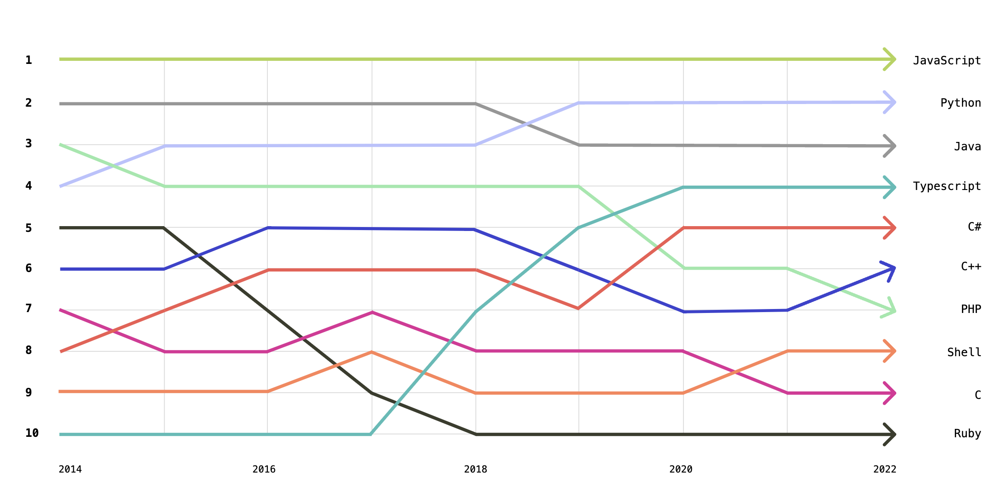

Pelo décimo segundo ano consecutivo, o JavaScript se destaca como a linguagem de programação mais utilizada, de acordo com uma pesquisa realizada em 2024 pela [Stack Overflow](https://survey.stackoverflow.co/2024/technology#most-popular-technologies). Este estudo englobou mais de 90 mil desenvolvedores de todo o mundo e abordou uma variedade de tópicos relacionados à tecnologia, comunidades, os frameworks mais populares e as linguagens de programação mais utilizadas.

|  |
|:--:| 
| *Popularidade de linguagens segundo github 2022* |

A verdade é que escolher uma linguagem para se trabalhar é algo **estratégico**! vou listar alguns critérios importantes para escolha de uma linguagem de forma estratégica.

- **Ecosistema e comunidade**: A linguagem de programação escolhida deve levar em consideração o tamanho da comunidade de usuários que utilizam e apoiam, prestam suporte para essa linguagem, para que exista conteúdos disponíveis para eventuais dúvidas e bugs. programar vai além das paredes de um quarto.

- **Tendencias do segmento**: é importante observar as tendencias do segmento para não tomar decisões pouco maduras, é importante que a escolha por uma linguagem não seja apenas porque ela 
é popular, porque ela é mais moderna, a escolha deve estar alinhada ao objetivo do tomador de decisão.

- **Conexões com outras linguagens e outros ecosistemas**: com a disponibilidade de diversas linguagens e tecnologias no mercado e diversos sistemas legados, há linguagens que podem aproveitar códigos pré-existentes de outras linguagens. Essa conexão entre linguagens pode acelerar o desenvolvimento e romper barreiras com sistemas legados.


- **Tipo de aplicação**: Deve-se ter um objetivo claro de qual rumo o projeto vai tomar, é importante ter em mente do tipo de aplicação envolvida, a complexidade que o projeto irá tomar, o tamanho da aplicação 

- **Facilidade de uso e aprendizagem**: Uma linguagem robusta pode ser mais difícil de desenvolver, mas pode proporcionar uma execução mais suave. É preciso prestar atenção na experiência da linguagem escolhida. Escolher uma linguagem que tenha fácil uso fará com que o software seja desenvolvido mais rápido e a linguagem tiver uma fácil aprendizagem, será mais rápido treinar outros profissionais e aprender mais rapidamente os detalhes da linguagem, essa velocidade encurta o tempo de desenvolvimento, proporcionando um desenvolvimento mais rápido e agil!

- **Disponibilidade de bibliotecas e suporte de fornecedores**: Seja qual for a linguagem de programação escolhida é importante ter o ecossistema de biblioteca disponível e o suporte do fornecedor. A capacidade de manutenção do software deve ser um ponto a ser avaliado na escolha, porque está diretamente ligado ao custo do projeto. A facilidade da manutenção é relevante para manter o software atualizado no longo prazo.

- **Requisitos de engenharia**: <br> 
  exemplo:
    - performance: deve garantir que o tempo de consulta não seja maior que 5 segundos
    - ser compatível com determinados browsers: ser compatível com Microsoft Edge versão 5 ou superior, ser compatível com firefox versão 1.0 ou superior

- **Disponibilidade profissional**: Prefira uma linguagem que um maior números de profissionais saibam programar, dessa forma será mais fácil encontrar possiveis colaboradores e mais vagas disponíveis no mercado.


## **Python**

Python é uma linguagem de programação de alto nível interpretada, com uma sintaxe simples, o que faz dela ser facilmente legível e *user-friendly*. Originalmente foi construido para satisfazer o desejo do seu criado Guido Van Rossum’s por uma linguagem que fosse simples de usar e bonito de se ver, Python theve sua primeira *release* publicada em 1991

**Fun fact**: O nome Python foi dado em homenagem ao programa de TV da BBC, “Monty Python's Flying Circus”.

Desde sua criação a linguagem cresceu e tornou-se amplamente aplicável a uma gama de profissionais, como desenvolvedores, cientistas de dados pesquisadores e outros.

Mas como, você pode se perguntar, uma linguagem de codificação pode ser simples e bonita de se ver? Aqui estão algumas provas, uma breve comparação com a linguagem Java:


### Python

```python
print("Hello world.")
```
### Java
```java
public class HelloWorld {
    public static void main (String[]args) {
      System.out.println.("Hello world");
    }
}
```
!!! note
    Python é muito menos verboso quando comparado ao Java! 😯

Desde que Python é uma linguagem de **propósito geral**, isso pode ser usado em uma variedade de aplicações e sua natureza descomplicada faz dela uma exelente linguagem para automação de tarefas, construir websites ou softwares e analise dados.

Fun Fact: Essa página foi construida utilizando um framework de Python

Python tem uma série de outras caractristicas que tornaram ela popular entre profissionais de **STEM (science, technology, engineering and mathematics)**.

## **Prós**

- **Fácil para Ler e aprender**: Além de sua relativa simplicidade de aprendizado ela é mais produtiva. Em comparação com outras linguagens de programação mais complexas, como C++, a sintaxe do Python permite que os usuários façam mais com menos e reduzam o tempo e o esforço para escrever as mesmas linhas de código.

- **Possui uma grande comunidade de usuários solidários**: Até mesmo os melhores desenvolvedores enfrentam problemas, e é nesse ponto que as comunidades de usuários podem se tornar um recurso inestimável. O Python tem uma enorme comunidade com documentação, tutoriais, dicas e truques para dominar a linguagem. A comunidade Python no GitHub, por exemplo, oferece tudo, desde informações sobre a versão mais recente da linguagem até relatórios de bugs e notas de atualização.

- **É Academica**: A linguagem Python se tornou a linguagem de referência no meio acadêmico, com alguns alunos tendo contato com ela desde o ensino fundamental. (Acredite ou não, há livros infantis ilustrados dedicados à linguagem Python.) Embora os alunos de ciência da computação aprendam Python com frequência, seu uso vai além dessa disciplina, abrangendo outras áreas de STEM e pesquisa acadêmica. Por exemplo, o Python pode ser usado para resolver equações diferenciais, realizar análises estatísticas, simular e rastrear a difusão de partículas e muito mais.

- **Tem alta demanda corporativa**: Devido à sua aplicabilidade em larga escala no trabalho de desenvolvimento e análise de dados, aprender e conhecer Python é frequentemente considerado uma das principais habilidades entre os candidatos a emprego. De acordo com o Statista, Python foi a terceira linguagem mais exigida em 2022 pelos recrutadores em todo o mundo. 
Ao analisar os visitantes por setor, o Stack Overflow observou que aqueles que visualizam perguntas relacionadas a Python estão mais comumente envolvidos no meio acadêmico, seguidos por eletrônicos, manufatura e setores de software. 

- **É Open Source**: Embora todos os direitos desse programa sejam reservados ao
  Instituto Python, ele é de código aberto e não há nenhuma
  limitação de uso, alteração e distribuição.Você pode usar e distribuir livremente o Python, mesmo para uso comercial. Não só você pode usar e distribuir softwares escritos nele, como também pode até mesmo fazer alterações no código-fonte do Python. O Python tem uma grande comunidade que o aprimora constantemente a cada iteração. 

- **É Portátil**: Os scripts Python podem ser usados em diferentes sistemas operacionais
  tais como: Windows, Linux, UNIX, Amigo, Mac OS, etc. Você pode mover programas Python de uma plataforma para outra e executá-los sem nenhuma alteração. Ele é executado sem problemas em quase todas as plataformas, incluindo Windows, Mac OS X e Linux.  Python também suporta outras tecnologias como COM, .Net .

- **É Extensivel e Incorporável**: Suponha que um aplicativo exija alto desempenho. Você pode
  combinar facilmente partes de C/C++ ou outras linguagens com
  código Python. Isso dará ao seu aplicativo alto desempenho, bem como recursos de script que outras linguagens podem não oferecer fora da caixa.


- **Possui uma biblioteca padrão ampla**: Essa biblioteca está disponível para qualquer pessoa acessar e significa que os usuários não precisam escrever código para cada função - eles podem acessar módulos integrados que ajudam com problemas na programação diária e muito mais


## **Contras**:

- **Não é fácil de manter**: Como o Python é uma linguagem tipada dinamicamente, isso pode significar algo bom ou ruim dependendo do contexto. À medida que uma aplicaão Python fica maior e mais complexa, isso pode se tornar difícil de manter, pois os erros se tornarão difíceis de rastrear e corrigir, portanto, será necessário ter experiência para projetar seu código e escrever bons testes unitários para facilitar a manutenção. 

- **É lenta**: Python é uma linguagem interpretada de alto nível, isso significa que ela abstrai muitos detalhes que o computador precisa entender, como por exemplo gerenciamento de memória, ponteiros etc. Apesar dela permitir você escrever código de uma forma mais próxima que os seres humanos pensam.


## Referencias

 Srinath, K. R. (2017). *Python – The Fastest Growing Programming Language*. *International Research Journal of Engineering and Technology, 4*(12), 354-357.

Rawat, A. (2020). *A Review on Python Programming*. *International Journal of Research in Engineering, Science and Management, 3*(12), 8-11.


GitHub. (2022). *Top Programming Languages*. Disponível em: [Octoverse 2022](https://octoverse.github.com/2022/top-programming-languages)


GitHub. (2024). *Why Python Keeps Growing, Explained*. Disponível em: [GitHub Blog](https://github.blog/developer-skills/programming-languages-and-frameworks/why-python-keeps-growing-explained/)


